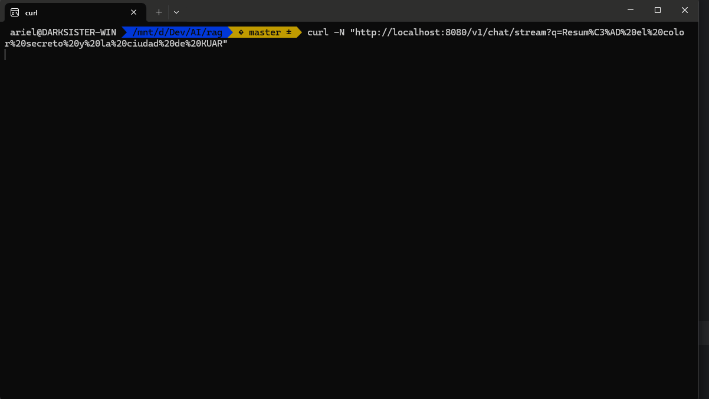

# RAG (Retrieval-Augmented Generation) System





## Stack

- **Backend**: Node.js + TypeScript + Fastify
- **Vector Database**: MySQL with JSON embeddings
- **Vector Search**: HNSW (Hierarchical Navigable Small World)
- **LLM**: Ollama with local model support
- **Containerization**: Docker + Docker Compose
- **Embeddings**: Nomic Embed Text model

## Quick Setup

### Start Services
```bash
docker-compose up -d
```

### Download Ollama Models
```bash
# Download the required LLM model
docker-compose exec ollama ollama pull llama3.1:latest

# Download the embedding model
docker-compose exec ollama ollama pull nomic-embed-text
```

# Streaming chat
curl -N "http://localhost:8080/v1/chat/stream?q=Your%20question%20here"

# Non-streaming chat
curl -X POST "http://localhost:8080/v1/chat" \
  -H "Content-Type: application/json" \
  -d '{"query": "Your question here"}'
```


